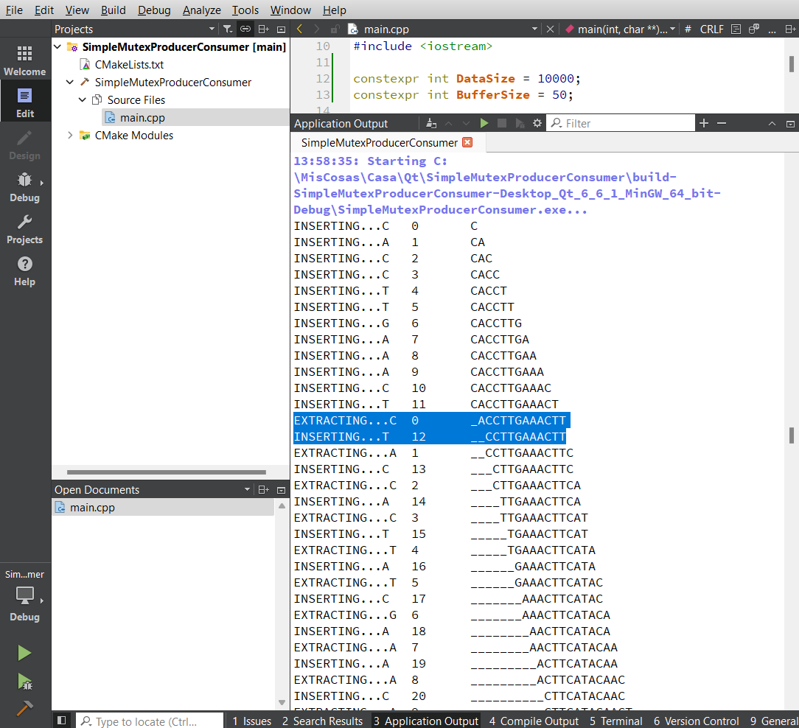

# Producer/Consumer Example using Wait Conditions with Qt C++

This example is just the example in this link: https://doc.qt.io/qt-6/qtcore-threads-waitconditions-example.html

Only this changes has been made in order to get a more clear output in the console:
 - An extra mutex (writtingMutex) for writting to the console.
 - Output with std::cout instead of fprintf.
 - Output to console in both producer and consumer.
 - A buffer of 50 and some "\n" seem very convenient to show the results easily to students. 
 
 this is a screenshot of the project:
  
  
 
As you can see in the previous screenshot there is a buffer and the Producer and Consumer threads can introduce and extract from the buffer at the same time. 

It's interesting to see that the 2 remarked lines show how the letter "T" has been introduced before the extracted C letter in the first marked line had been written in the console. This is because lines 39, 70 and 71 in the code permit that both threads work simultanously.

## Getting Started

It's interesting you start working with the original link tutorial: https://doc.qt.io/qt-6/qtcore-threads-waitconditions-example.html.

### Prerequisites

You need a working environment with:
* [Git](https://git-scm.com) - You can install it from https://git-scm.com/downloads.
* [Qt](https://www.qt.io/download-open-source) - Install the community version.

## General Installation instructions

The best option to start with this project is cloning it in your PC:

```
git clone https://github.com/tcrurav/QtProducerConsumerUsingWaitConditions.git
```

Open and run the project from the Qt Creator.

Enjoy!!!

## Built With

* [Qt Creator](https://www.qt.io/download-open-source) - Install the community version.

## Acknowledgments

* https://doc.qt.io/qt-6/qtcore-threads-waitconditions-example.html. This project is just the same with some little adjustments to explain it in my classroom in a more convenient way for me.
* https://www.w3schools.com/cpp/. An introduction to C++.
*https://github.com/PurpleBooth/a-good-readme-template. A good README.md template.